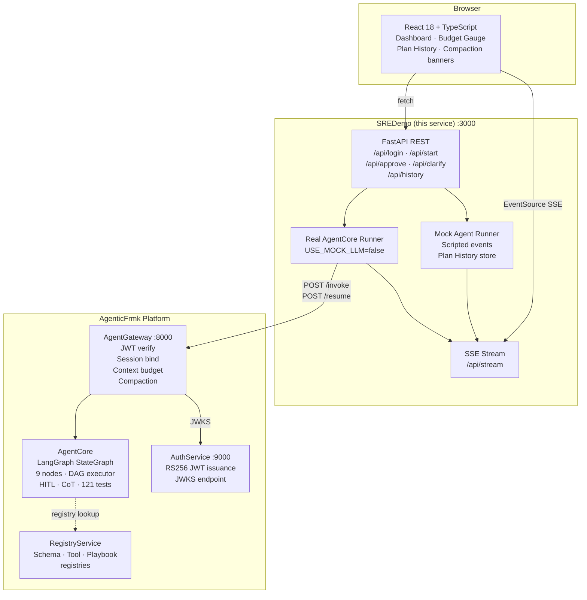
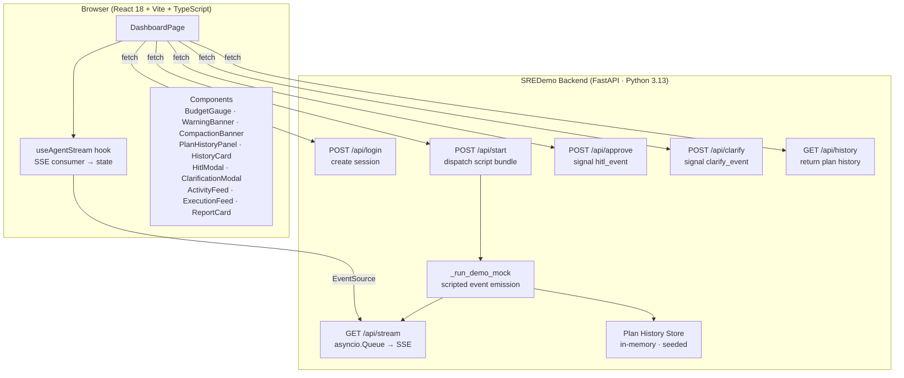
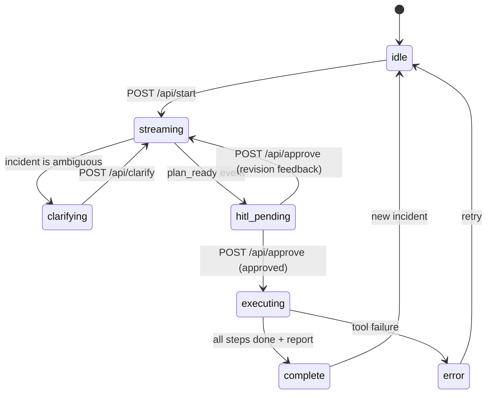
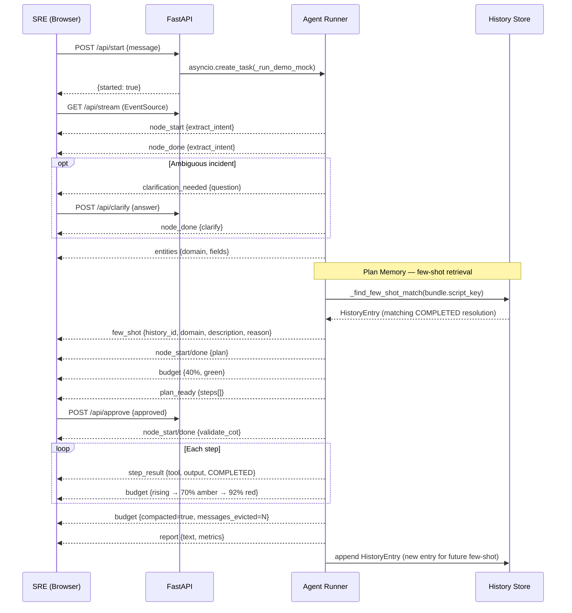
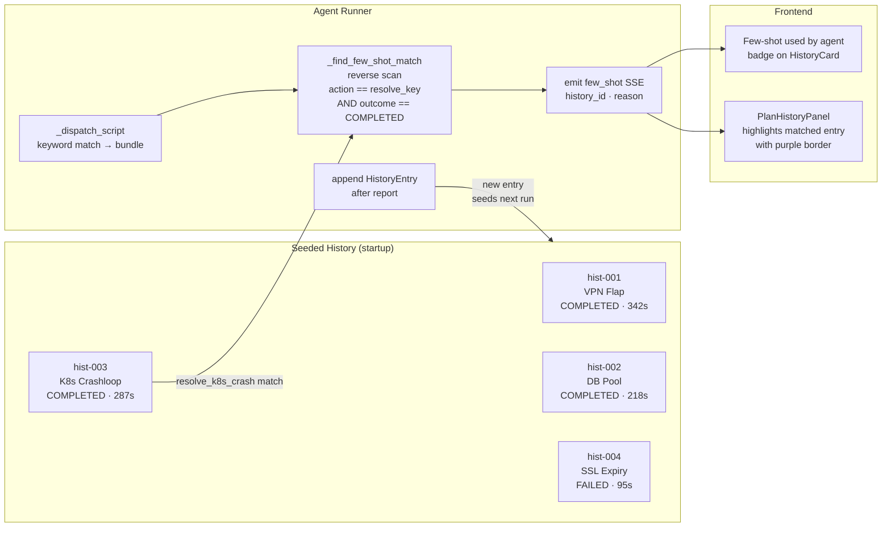
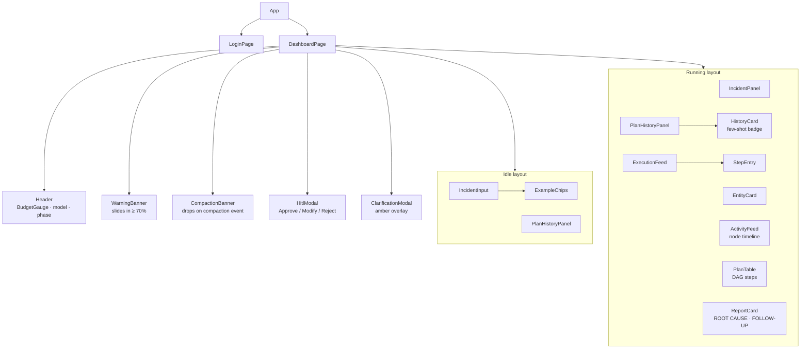

# SREDemo

> **Hackathon Submission — AI-powered SRE incident remediation with human oversight, plan memory, and live context management.**

---

> [!IMPORTANT]
> **Built for this hackathon:**
>
> | | |
> |---|---|
> | **SREDemo** | Brand new — React web UI, FastAPI SSE backend, synthetic data layer, mock agent runner |
> | **AuthService** | Brand new — RS256 JWT issuance, JWKS endpoint, bcrypt user store, Alembic migrations |
> | **AgentGateway** | Brand new — JWT verification, session binding, invoke/resume endpoints, context budget management, sliding window compaction, summarisation on eviction, model registry |
> | **Plan Memory** | New in AgentCore — few-shot retrieval from past incidents injected into the planner prompt |
> | **Playbook Evolution** | New in AgentCore — pattern extraction from resolved incidents, suggestions API |
> | **Model selection** | SREDemo calls `GET /models`, user picks LLM, gateway forwards choice to AgentCore |
>
> **Pre-existing foundation (not claimed as hackathon work):**
>
> | | |
> |---|---|
> | **AgentCore framework** | LangGraph StateGraph, 9 nodes (intent → plan → HITL → CoT → entities → execute → report), DAG executor, 121 tests |

---

## The Problem

A P1 incident at 3 AM costs an average **$5,600 per minute** in lost revenue (Gartner, 2023).
A senior SRE spends **45–90 minutes** per incident on triage — not because they are slow, but because the investigation is genuinely hard.

The real cost is not the outage. It is the cognitive load: correlating signals across AWS, Datadog, PagerDuty, and Kubernetes while exhausted, under pressure, and interrupted by stakeholders every 10 minutes.

## What We Built

An AI agent that does the investigation for you — and then **asks your permission** before touching anything in production.

```
SRE types one sentence →  agent investigates → agent proposes a plan
                        →  you approve       → agent executes step by step
                        →  you get a report
```

**Time to remediation: under 5 minutes.** The human stays in the loop at the only moment that matters: the decision to act.

---

## Live Demo

```bash
git clone https://github.com/thelastmile-ai/SREDemo
cd SREDemo && cp .env.example .env
docker compose up --build   # → http://localhost:3000
```

No AWS, Datadog, or PagerDuty credentials needed. Full mock mode ships by default.
Set `USE_MOCK_LLM=false` and add `ANTHROPIC_API_KEY` for live Claude-powered execution.

---

## What Makes This Different

### Plan Memory — the agent gets smarter with every incident

Most agents start from zero every time. Ours doesn't. Every resolved incident is stored and the agent retrieves the most relevant past resolution before planning a new one. The UI shows exactly which past incident the agent learned from — with a **"Few-shot used by agent"** badge on the history card.

### Context budget management — made visible, not hidden

Long agent sessions hit LLM context limits. Most systems fail silently or crash. Ours:
- Tracks token usage in real time with an arc gauge in the header
- Shows an amber warning banner before the limit is reached
- Compacts the context window automatically (sliding window + summarisation)
- Drops a visible banner when compaction happens so the user always knows what the agent is doing

### Hard HITL gate — not advisory

The remediation plan cannot execute without explicit human approval. This is enforced at the gateway level, not just in the UI. The human can also provide natural-language revision feedback to regenerate the plan before approving.

### Honest about what's real

- **Mock mode (default):** fully scripted, no external APIs, runs in Docker with one command
- **Live mode:** real Claude calls through AgentCore + AgentGateway; real AWS/Datadog/PagerDuty with credentials
- **RegistryService:** fully designed and specced; implementation is the next milestone

---

---

## Live Demo

```bash
docker compose up --build   # http://localhost:3000
```

No AWS, Datadog, or PagerDuty credentials needed — full mock mode ships out of the box.

---

## Platform Position

SREDemo is a **use-case application** built on top of the AgenticFrmk platform. It is not a standalone demo — it runs on five production services:



**In `USE_MOCK_LLM=true` mode** (default): SREDemo runs a fully scripted mock runner — no calls to AgentGateway or AgentCore. Events are emitted from pre-defined script bundles with realistic delays.

**In `USE_MOCK_LLM=false` mode**: SREDemo calls `AgentGateway → AgentCore → Claude` for real LLM-driven incident handling.

---

## What It Does

An SRE types one plain-English sentence. The agent handles everything else:

```
K8s pods are OOMKilled every 2 minutes in production — payment-service is down
```

| Phase | What happens |
|-------|-------------|
| **Intent** | Classifies domain, action, and severity from free text |
| **Clarify** | Asks one targeted question if the incident is ambiguous |
| **Entities** | Extracts typed fields (severity, services, namespaces) |
| **Plan** | Builds a grounded tool-call DAG — no hallucinated actions |
| **HITL** | Presents the plan for human approval before a single change is made |
| **Execute** | Runs steps in dependency order; streams each result live |
| **Report** | Delivers root cause, actions taken, and follow-up recommendations |

---

## Key Features

### 1 · Free-text incident input with guided examples
No alert IDs, no forms, no structured data required. Example chips guide new users to the right phrasing for each scenario.

### 2 · Clarification before action
The agent asks exactly one follow-up question when the incident is ambiguous — before committing to a plan. This mirrors how a senior SRE thinks.

### 3 · Human-in-the-Loop approval gate
Every remediation plan is shown to a human before execution. The plan cannot proceed without explicit approval. The human can also provide natural-language revision feedback to regenerate the plan.

### 4 · Plan Memory with few-shot learning
Past incident resolutions are stored and displayed in the Plan History panel. When the agent handles a similar incident, it:
1. Searches the history for a matching `resolve_<domain>` action with `COMPLETED` outcome
2. Injects the matched resolution as a few-shot example into the planner prompt
3. Emits a `few_shot` SSE event with `history_id`, domain, and reason
4. The UI shows a **"Few-shot used by agent"** badge on the relevant history card

The agent starts from proven patterns, not from scratch. Every resolved incident makes future resolutions faster.

### 5 · Live context budget monitoring
The header arc gauge shows real-time token usage with three visual states (green / amber / red). When the gateway compacts the context window, an animated banner drops from the top of the screen and the gauge resets — making an invisible AI behaviour transparent and trustworthy.

### 6 · Warning banner before threshold breach
A sliding amber/red banner warns the SRE when the agent is approaching its context limit — before degraded behaviour could occur.

---

## Architecture

### Full System — Platform + SREDemo



### Agent State Machine



### Full Event Sequence (including Plan Memory)



### Plan Memory Architecture



### Frontend Component Tree



### SSE Event Catalogue

| Event | Payload | Frontend effect |
|-------|---------|----------------|
| `node_start` | `{node}` | ActivityFeed — node appears as "running" |
| `node_done` | `{node}` | ActivityFeed — node marks "done" with elapsed time |
| `clarification_needed` | `{question}` | ClarificationModal opens |
| `entities` | `{entities, clarification_context?}` | EntityCard populated |
| `few_shot` | `{history_id, domain, description, reason}` | HistoryCard badge lit |
| `plan_ready` | `{steps[]}` | HitlModal opens with DAG |
| `step_result` | `{step_id, tool, status, output}` | ExecutionFeed row added |
| `budget` | `{budget_used, estimated_tokens, compacted, messages_evicted}` | BudgetGauge + banners |
| `report` | `{text, metrics}` | ReportCard rendered |
| `error` | `{message}` | Toast + phase → error |

---

## Demo Scenarios

| Chip | Scenario | Domain | Has Clarification | Few-Shot Match |
|------|----------|--------|:-----------------:|:---:|
| 🔌 VPN Flap | IKE phase 2 lifetime mismatch — Boston / NY / Chicago | networking | | hist-001 |
| 🐘 DB Overload | PostgreSQL connection pool exhausted — checkout-service v2.14.3 | database | | hist-002 |
| ☸ K8s Crashloop | payment-service OOMKilled — TransactionCache unbounded growth | kubernetes | ✓ | hist-003 |
| 🔒 SSL Expiry | Let's Encrypt auto-renewal cron silent failure — api.acme.com | security | | — (hist-004 is FAILED) |

---

## Context Budget Lifecycle

Every run shows the full context management lifecycle — the AI managing its own memory, made visible:

```
Post-plan      ████░░░░░░  40%  green   — planning complete
Early exec     ███████░░░  70%  amber   — WarningBanner slides in
Mid exec       █████████░  92%  red     — WarningBanner turns red
               ↓ COMPACTION #1 ↓        — banner drops, gauge resets
Late exec      ████████░░  75%  amber   — context filling again
Post exec      █████████░  91%  red     — second spike
               ↓ COMPACTION #2 ↓        — banner drops again
Report phase   ██████░░░░  63%  green   — clean finish
```

---

## Quick Start

```bash
git clone https://github.com/AgenticFrmk/SREDemo
cd SREDemo
cp .env.example .env
# Only ANTHROPIC_API_KEY is required for demo mode
docker compose up --build
```

Open **http://localhost:3000**

1. Log in with any username / password
2. Click an example chip (e.g. **☸ K8s Crashloop**)
3. Answer the clarification question
4. Watch the **"Few-shot used by agent"** badge appear in the Plan History panel
5. Review and approve the remediation plan
6. Watch steps execute and the budget gauge animate through amber → red → compaction
7. Read the final incident report

---

## Tech Stack

| Layer | Technology |
|-------|-----------|
| Agent framework | [AgentCore](../AgentCore) — LangGraph StateGraph |
| LLM | Claude Sonnet 4.6 (Anthropic) |
| Backend | FastAPI + uvicorn, Python 3.13 |
| Streaming | Server-Sent Events (SSE) via `asyncio.Queue` |
| Frontend | React 18 + Vite + TypeScript |
| Styling | Tailwind CSS |
| Animation | Framer Motion |
| Charts | Recharts (token sparkline) |
| Icons | Lucide React |
| Container | Docker multi-stage (Node → Python) |

---

## File Structure

```
SREDemo/
├── docker-compose.yml
├── Dockerfile                        multi-stage: npm build → python serve
├── pyproject.toml
├── .env.example
├── hackathon/
│   └── record_demo.py                Playwright automation — records MP4 demo
├── presentation/
│   ├── VC-PITCH.md                   Investor pitch document
│   ├── LUMA-SUBMISSION.md            Hackathon submission text
│   └── VIDEO-SCRIPT.md              Narration script for demo recording
└── sre_demo/
    └── web/
        ├── server.py                 FastAPI: SSE + REST + static serving
        │                             Includes: script bundles, plan history,
        │                             few-shot matching, budget simulation
        └── frontend/
            └── src/
                ├── pages/
                │   ├── LoginPage.tsx
                │   └── DashboardPage.tsx   main state controller
                ├── components/
                │   ├── IncidentInput.tsx    free-text entry + example chips
                │   ├── ExampleChips.tsx     scenario shortcut pills
                │   ├── ClarificationModal.tsx  amber HITL overlay
                │   ├── HitlModal.tsx        plan approval overlay
                │   ├── ActivityFeed.tsx     animated node timeline
                │   ├── EntityCard.tsx       extracted entity fields
                │   ├── PlanTable.tsx        plan step DAG table
                │   ├── ExecutionFeed.tsx    live step results
                │   ├── ReportCard.tsx       final incident report
                │   ├── BudgetGauge.tsx      arc gauge + sparkline
                │   ├── WarningBanner.tsx    amber/red sliding banner
                │   ├── CompactionBanner.tsx animated drop strip
                │   ├── PlanHistoryPanel.tsx collapsible history rail
                │   └── HistoryCard.tsx      past incident + few-shot badge
                ├── hooks/
                │   ├── useAgentStream.ts   SSE consumer → component state
                │   └── useSession.ts       session storage
                └── lib/
                    ├── api.ts              fetch wrappers
                    └── types.ts            shared TypeScript interfaces
```

---

## Environment Variables

| Variable | Required | Default | Description |
|----------|----------|---------|-------------|
| `ANTHROPIC_API_KEY` | **Yes** (real LLM only) | — | Claude API key |
| `USE_MOCK_LLM` | No | `true` | `true` = scripted mock, no API calls |
| `USE_SYNTHETIC_DATA` | No | `true` | Patch tools with synthetic responses |
| `DEMO_CONTEXT_LIMIT` | No | `15000` | Token ceiling shown in budget gauge |
| `DEMO_COMPACT_THRESHOLD` | No | `0.80` | Fraction that triggers compaction simulation |
| `SERVER_PORT` | No | `3000` | Exposed port |

---

## Responsible AI Design

- **No autonomous production changes** — the HITL gate is a hard stop, not advisory
- **Grounded planning** — tool contracts constrain what the LLM can propose; hallucinated tool names fail plan validation
- **Playbook hard rules** — domain-specific rules validated after planning; a violation rejects the plan before execution
- **Context transparency** — the user sees exactly how much of the AI's memory is consumed and when it is compacted
- **Identity-locked sessions** — in full-platform mode, AgentGateway locks each thread to the originating user's JWT identity
