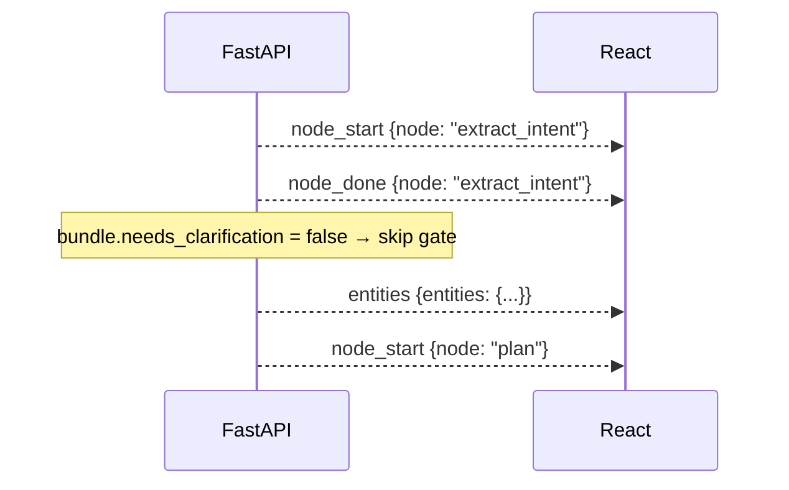

# Design: Section 2 — Clarification HITL Round

## HLD

### Component Diagram

```mermaid
graph LR
    subgraph Browser
        CM[ClarificationModal]
        AF[ActivityFeed<br/>+clarify node]
        DP[DashboardPage]
    end

    subgraph FastAPI server.py
        CLARIFY[POST /api/clarify]
        MOCK[_run_demo_mock<br/>clarification gate]
    end

    MOCK -->|clarification_needed event| DP
    DP -->|shows| CM
    CM -->|POST /api/clarify {answer}| CLARIFY
    CLARIFY -->|sets clarify_event| MOCK
    MOCK -->|entities event +clarification_context| DP
    DP -->|node: clarify| AF
```

### Data Flow
1. Mock runner completes `extract_intent`; checks `bundle.needs_clarification`.
2. If `true`: emits `clarification_needed { question }` SSE event; awaits `clarify_event`.
3. UI receives event → `ClarificationModal` appears.
4. Operator types answer → `POST /api/clarify { session_id, answer }` → server sets `clarify_event`.
5. Mock runner resumes; appends `clarification_context` to the `entities` SSE payload.
6. `ActivityFeed` shows a `clarify` node between `extract_intent` and `plan`.
7. If `bundle.needs_clarification = false`, the entire gate is skipped — zero UI change.

### Key Decisions
- **Separate `asyncio.Event`**: The clarification gate uses its own `clarify_event` on `DemoSession` — independent from `hitl_event` — so HITL approval logic is untouched.
- **Modal reuse pattern**: `ClarificationModal` is a stripped-down `HitlModal` — same dark overlay, same animation — but with a text input instead of a plan table.
- **`clarification_context` on entities**: Appending the answer to the entities payload keeps the data model simple — no new state key needed in `useAgentStream`.

---

## LLD

### Python — `server.py`

#### `DemoSession` (updated)
```python
@dataclass
class DemoSession:
    ...
    clarify_event: asyncio.Event = field(default_factory=asyncio.Event)
    clarify_answer: str | None = None
```

#### New endpoint
```python
class ClarifyRequest(BaseModel):
    session_id: str
    answer: str

@app.post("/api/clarify")
async def api_clarify(body: ClarifyRequest) -> dict:
    session = _sessions.get(body.session_id)
    if not session:
        raise HTTPException(status_code=404, detail="Session not found")
    if session.clarify_event.is_set():
        raise HTTPException(status_code=409, detail="Clarification already resolved")
    session.clarify_answer = body.answer
    session.clarify_event.set()
    return {"clarified": True}
```

#### `_run_demo_mock` clarification gate
```python
async def _run_demo_mock(session: DemoSession) -> None:
    bundle = session.script
    ...
    # After extract_intent node:
    if bundle.needs_clarification:
        await _push(session, "node_start", {"node": "clarify"})
        await _push(session, "clarification_needed", {"question": bundle.clarification_question})
        await session.clarify_event.wait()
        await _push(session, "node_done", {"node": "clarify"})
        clarification_context = f"Operator confirmed: {session.clarify_answer}"
    else:
        clarification_context = None

    # entities push:
    entities_payload = {"entities": bundle.entities}
    if clarification_context:
        entities_payload["clarification_context"] = clarification_context
    await _push(session, "entities", entities_payload)
    ...
```

### React — `ClarificationModal.tsx`
```tsx
interface ClarificationModalProps {
  question: string
  onSubmit: (answer: string) => Promise<void>
}
// Dark overlay (same as HitlModal)
// <p>{question}</p>
// <textarea value={answer} onChange={...} />
// <button disabled={answer.trim().length < 5}>Submit</button>
```

### `useAgentStream.ts` changes

New state field:
```ts
interface AgentStreamState {
  ...
  clarification: { question: string } | null
  clarificationContext: string | null
}
```

New event handler:
```ts
case "clarification_needed":
  dispatch({ type: "SET_CLARIFICATION", payload: { question: data.question } })
  break
```

`entities` handler updated:
```ts
case "entities":
  dispatch({ type: "SET_ENTITIES", payload: data.entities })
  if (data.clarification_context) {
    dispatch({ type: "SET_CLARIFICATION_CONTEXT", payload: data.clarification_context })
  }
  break
```

### `DashboardPage` changes
```tsx
const showClarification = !!state.clarification && state.phase !== 'hitl_pending'

const handleClarify = async (answer: string) => {
  await api.clarify(session.session_id, answer)
  // modal auto-closes via state update
}
...
{showClarification && (
  <ClarificationModal
    question={state.clarification.question}
    onSubmit={handleClarify}
  />
)}
```

### `ActivityFeed` — node label additions
```ts
const NODE_LABELS: Record<string, string> = {
  ...
  clarify: "Clarification",
}
```

### `api.ts` addition
```ts
clarify(sessionId: string, answer: string): Promise<void>
// POST /api/clarify { session_id: sessionId, answer }
```

### Error Handling

| Scenario | Behaviour |
|----------|-----------|
| `POST /api/clarify` on unknown session | 404 |
| `POST /api/clarify` called twice | 409 Conflict |
| Operator closes modal without answering | Modal stays open (no close button) — must answer |
| `bundle.needs_clarification = false` | Entire gate skipped; no modal, no SSE event |

---

## Sequence Diagrams

### Happy Path — Clarification Round

```mermaid
sequenceDiagram
    actor Operator
    participant UI as React
    participant Server as FastAPI

    Server-->>UI: node_start {node: "extract_intent"}
    Server-->>UI: node_done  {node: "extract_intent"}
    Server-->>UI: node_start {node: "clarify"}
    Server-->>UI: clarification_needed {question: "Is this prod or staging?"}
    UI->>UI: ClarificationModal slides in
    Operator->>UI: types "Production — all three US regions"
    Operator->>UI: clicks Submit
    UI->>Server: POST /api/clarify {session_id, answer}
    Server->>Server: session.clarify_answer = answer; clarify_event.set()
    Server-->>UI: {clarified: true}
    UI->>UI: ClarificationModal dismissed
    Server-->>UI: node_done {node: "clarify"}
    Server-->>UI: entities {entities: {...}, clarification_context: "Operator confirmed: Production…"}
    Server-->>UI: node_start {node: "plan"}
    Note over UI: normal plan → HITL → execute flow
```

### Skip Path — No Clarification Needed


