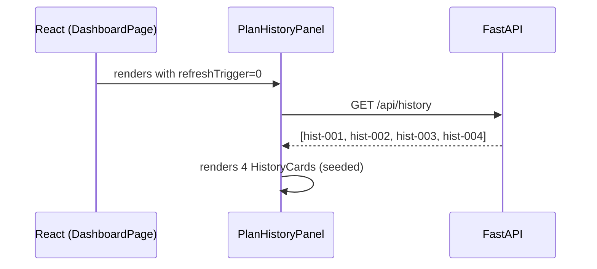
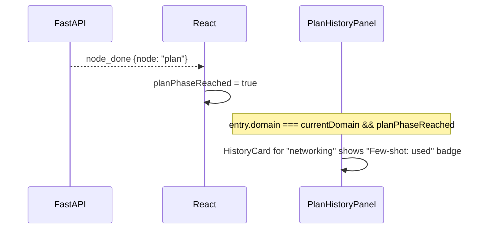

# Design: Section 3 — Plan History Panel

## HLD

### Component Diagram

```mermaid
graph LR
    subgraph Browser
        PHP[PlanHistoryPanel]
        HC[HistoryCard]
        DP[DashboardPage]
    end

    subgraph FastAPI server.py
        HIST_EP[GET /api/history]
        HIST_STORE[_history_store<br/>list of HistoryEntry<br/>pre-seeded on startup]
        REPORT_HANDLER[report SSE event<br/>→ append to store]
    end

    DP -->|on mount + on report event| PHP
    PHP -->|GET /api/history| HIST_EP
    HIST_EP -->|reads| HIST_STORE
    HIST_EP -->>|[HistoryEntry]| PHP
    PHP -->|renders| HC
    REPORT_HANDLER -->|appends| HIST_STORE
```

### Data Flow
1. Server startup seeds `_history_store` with 4 historical `HistoryEntry` dicts.
2. `DashboardPage` fetches `GET /api/history` on first render and populates `PlanHistoryPanel`.
3. Mock runner, after emitting `report`, appends a new `HistoryEntry` to `_history_store`.
4. Frontend receives the `report` SSE event → re-fetches `GET /api/history` → panel shows the new entry at the top.
5. "Few-shot used" badge appears on any entry whose `domain` matches the current run domain (client-side logic, set when `plan` node completes).

### Key Decisions
- **In-memory store**: No database required for hackathon. Server restart resets to seed data — acceptable demo behavior.
- **Client re-fetch on `report` event**: Polling would require an interval; re-fetching on the one known update trigger is simpler and sufficient.
- **Few-shot badge is client-side**: The server doesn't know which entry was used — the badge is cosmetic, set when `domain` matches. Shows the concept convincingly without wiring into AgentCore.
- **Collapsible panel**: History panel hides on narrow breakpoints to preserve dashboard space; expanded by default on ≥1440px wide screens.

---

## LLD

### Python — `server.py`

#### In-memory store
```python
from datetime import datetime, timezone

@dataclass
class HistoryEntry:
    id: str
    action: str
    domain: str
    description: str
    outcome: str           # "COMPLETED" | "FAILED"
    steps_count: int
    resolved_at: str       # ISO 8601
    duration_seconds: int

_history_store: list[HistoryEntry] = []

def _seed_history() -> None:
    now = datetime.now(timezone.utc)
    _history_store.extend([
        HistoryEntry("hist-001", "resolve_vpn_flap", "networking",
                     "VPN tunnel flap — Boston/NY/Chicago (IKE phase 2 mismatch)",
                     "COMPLETED", 11,
                     "2026-04-25T14:32:00Z", 342),
        HistoryEntry("hist-002", "resolve_db_pool_exhaustion", "database",
                     "PostgreSQL connection pool exhausted — checkout service",
                     "COMPLETED", 8,
                     "2026-04-25T09:15:00Z", 218),
        HistoryEntry("hist-003", "resolve_k8s_crashloop", "kubernetes",
                     "payment-service pods OOMKilled in prod namespace",
                     "COMPLETED", 9,
                     "2026-04-25T22:47:00Z", 287),
        HistoryEntry("hist-004", "resolve_ssl_expiry", "security",
                     "SSL cert expired on api.acme.com — 1200 users blocked",
                     "FAILED", 4,
                     "2026-04-25T11:03:00Z", 95),
    ])
```

#### Called in `lifespan`
```python
@asynccontextmanager
async def lifespan(app: FastAPI):
    if USE_SYNTHETIC:
        from sre_demo.synthetic import patch_synthetic_tools
        patch_synthetic_tools()
    _seed_history()
    yield
```

#### Endpoint
```python
@app.get("/api/history")
async def api_history() -> list[dict]:
    return [asdict(h) for h in reversed(_history_store[-20:])]
```

#### Mock runner — append on completion
```python
# At the end of _run_demo_mock, before queue.put(None):
_history_store.append(HistoryEntry(
    id=f"live-{session.session_id[:8]}",
    action=f"resolve_{bundle.script_key}",
    domain=bundle.domain,
    description=session.message[:80],
    outcome="COMPLETED",
    steps_count=len(bundle.steps),
    resolved_at=datetime.now(timezone.utc).isoformat(),
    duration_seconds=int(time.time() - session.start_time),
))
```

`DemoSession` gets `start_time: float = field(default_factory=time.time)`.

### TypeScript — `types.ts`
```ts
export interface HistoryEntry {
  id: string
  action: string
  domain: string
  description: string
  outcome: "COMPLETED" | "FAILED"
  steps_count: number
  resolved_at: string
  duration_seconds: number
}
```

### `api.ts` addition
```ts
history(): Promise<HistoryEntry[]>
// GET /api/history
```

### React — `PlanHistoryPanel.tsx`
```tsx
interface PlanHistoryPanelProps {
  currentDomain: string | null    // to show "few-shot used" badge
  planPhaseReached: boolean       // badge only shows after plan node fires
  refreshTrigger: number          // bumped by DashboardPage on "report" event
}
// Internal: useState<HistoryEntry[]> + useEffect to fetch on mount + refreshTrigger change
// Renders list of HistoryCard components
```

### React — `HistoryCard.tsx`
```tsx
interface HistoryCardProps {
  entry: HistoryEntry
  fewShotUsed: boolean   // true when entry.domain === currentDomain && planPhaseReached
}
// Collapsed view: domain badge, action name, time-ago, outcome badge, step count
// Expanded view (click to toggle): step list (read-only, from bundle.steps if available — otherwise just count)
```

### `DashboardPage` changes
```tsx
const [historyRefreshCount, setHistoryRefreshCount] = useState(0)

// In useEffect watching state.phase:
if (curr === 'complete') {
  setHistoryRefreshCount(c => c + 1)
}

// Render:
<PlanHistoryPanel
  currentDomain={state.entities?.networking ? "networking" : null}
  planPhaseReached={state.phase !== 'idle' && state.phase !== 'typing'}
  refreshTrigger={historyRefreshCount}
/>
```

### Layout change
History panel occupies a collapsible right-rail (240px) on screens ≥1440px; collapses to an icon + count badge on narrower screens.

### Error Handling

| Scenario | Behaviour |
|----------|-----------|
| `GET /api/history` fails | Panel shows empty state ("No history yet") |
| More than 20 entries | Server returns last 20 only |
| Session start_time missing | `duration_seconds` defaults to 0 |

---

## Sequence Diagrams

### Initial Load



### Live Run Completes — Panel Updates

```mermaid
sequenceDiagram
    participant Server as FastAPI
    participant UI as React
    participant PHP as PlanHistoryPanel

    Server-->>UI: report {text, metrics}
    UI->>UI: setHistoryRefreshCount(1)
    Note over UI: refreshTrigger bumped
    PHP->>Server: GET /api/history (triggered by refreshTrigger change)
    Server-->>PHP: [live-run, hist-001, hist-002, hist-003, hist-004]
    PHP->>PHP: re-renders; live entry appears at top
```

### Few-Shot Badge


