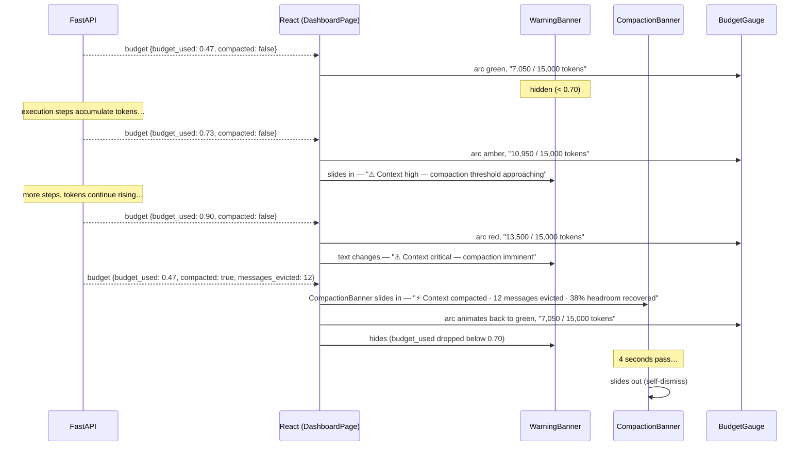

# Design: Section 4 — Budget Visibility & Compaction Drama

## HLD

### Component Diagram

```mermaid
graph LR
    subgraph Browser
        BG[BudgetGauge<br/>updated — 3-zone arc + token text]
        WB[WarningBanner<br/>new — sticky below header]
        CB[CompactionBanner<br/>new — full-width animated strip]
        DP[DashboardPage]
    end

    subgraph FastAPI server.py
        BUDGET_EVT[budget SSE event<br/>compacted, messages_evicted, budget_used]
    end

    BUDGET_EVT -->>|via useAgentStream| DP
    DP --> BG
    DP --> WB
    DP --> CB
```

### Data Flow
1. Every `budget` SSE event updates `state.budget` in `useAgentStream`.
2. `BudgetGauge` re-renders with new zone colour and token text.
3. `DashboardPage` passes `budget.budget_used` to `WarningBanner`; it renders/hides based on thresholds.
4. When `budget.compacted === true` arrives, `DashboardPage` sets `showCompaction = true`; `CompactionBanner` animates in.
5. After 4 seconds `CompactionBanner` sets `showCompaction = false` and animates out.
6. Existing toast calls for compaction are removed from `DashboardPage`.

### Key Decisions
- **No new SSE events**: All data already exists in the `budget` event payload. This is purely a UI enhancement.
- **`CompactionBanner` self-dismissing via `useEffect`**: A `useEffect` on `showCompaction` runs `setTimeout(4000)` → sets `showCompaction = false`. Simple, no external timer library.
- **`WarningBanner` is a stateless render**: It derives its state entirely from `budgetUsed` prop — no internal state, easy to test.
- **Token counter next to gauge**: Text positioned below the arc SVG within `BudgetGauge` — no layout change to other components.
- **Remove toasts for compaction**: The banner replaces the toast to avoid duplicate notifications. Budget-high toast (at 70%) is also replaced by the `WarningBanner`.

---

## LLD

### React — `BudgetGauge.tsx` (updated)

```tsx
// Zone thresholds
const AMBER_THRESHOLD = 0.70
const RED_THRESHOLD   = 0.90

function zoneColor(pct: number): string {
  if (pct >= RED_THRESHOLD)   return '#f85149'   // red
  if (pct >= AMBER_THRESHOLD) return '#e3b341'   // amber
  return '#3fb950'                                // green
}

// SVG arc stroke-color driven by zoneColor(budget_used)
// Token text below arc:
// <text>{estimated_tokens.toLocaleString()} / {context_limit.toLocaleString()} tokens</text>
```

### React — `WarningBanner.tsx` (new)

```tsx
interface WarningBannerProps {
  budgetUsed: number   // 0–1
}

export default function WarningBanner({ budgetUsed }: WarningBannerProps) {
  if (budgetUsed < 0.70) return null

  const isCritical = budgetUsed >= 0.90
  const text = isCritical
    ? '⚠ Context critical — compaction imminent'
    : '⚠ Context high — compaction threshold approaching'

  return (
    <motion.div
      initial={{ height: 0, opacity: 0 }}
      animate={{ height: 44, opacity: 1 }}
      exit={{ height: 0, opacity: 0 }}
      transition={{ duration: 0.3 }}
      className={`w-full flex items-center justify-center text-xs font-medium
        ${isCritical
          ? 'bg-red-500/15 border-b border-red-500/30 text-red-400'
          : 'bg-amber-500/10 border-b border-amber-500/20 text-amber-400'
        }`}
    >
      {text}
    </motion.div>
  )
}
```

### React — `CompactionBanner.tsx` (new)

```tsx
interface CompactionBannerProps {
  visible: boolean
  messagesEvicted: number
  headroomPct: number   // integer 0–100
}

export default function CompactionBanner({ visible, messagesEvicted, headroomPct }: CompactionBannerProps) {
  return (
    <AnimatePresence>
      {visible && (
        <motion.div
          initial={{ y: -60, opacity: 0 }}
          animate={{ y: 0, opacity: 1 }}
          exit={{ y: -60, opacity: 0 }}
          transition={{ duration: 0.35 }}
          className="w-full bg-purple-500/20 border-b border-purple-500/40
                     flex items-center justify-center gap-3 py-3 text-sm"
        >
          <span className="text-purple-300 font-semibold">⚡ Context compacted</span>
          <span className="text-[#8b949e]">
            {messagesEvicted} messages evicted · {headroomPct}% headroom recovered
          </span>
        </motion.div>
      )}
    </AnimatePresence>
  )
}
```

### `DashboardPage` changes

```tsx
const [showCompaction, setShowCompaction] = useState(false)
const [compactionData, setCompactionData] = useState({ evicted: 0, headroom: 0 })
const prevCompacted = useRef(false)

useEffect(() => {
  if (!state.budget) return
  const { compacted, messages_evicted, budget_used, context_limit, estimated_tokens } = state.budget

  if (compacted && !prevCompacted.current) {
    const headroomPct = Math.round((messages_evicted / (messages_evicted + (estimated_tokens / (context_limit / 100)))) * 100)
    setCompactionData({ evicted: messages_evicted, headroom: headroomPct })
    setShowCompaction(true)
    const t = setTimeout(() => setShowCompaction(false), 4000)
    return () => clearTimeout(t)
  }
  prevCompacted.current = compacted
}, [state.budget])

// Remove existing toast calls for compaction (lines ~65–72 in current DashboardPage)
```

#### Layout insertion — banner slots between header and main:
```tsx
<header>...</header>
<AnimatePresence>
  <WarningBanner budgetUsed={state.budget?.budget_used ?? 0} />
</AnimatePresence>
<CompactionBanner
  visible={showCompaction}
  messagesEvicted={compactionData.evicted}
  headroomPct={compactionData.headroom}
/>
<main>...</main>
```

### Mock runner — reliable budget trigger

The mock runner token accumulation must reliably cross 70% (10,500 tokens out of 15,000) before the final compaction fires. Current accumulation is 4,600 tokens after plan. Add step-by-step increments to ensure the warning zone is hit:

```python
# after each step_result:
token_step += 350   # was 400; keep same but start higher (start at 1200 instead of 800)
```

Start value: `token_step = 1200`. After 11 steps at 350 each: 1200 + 11×350 = 5,050. After pre-step phase: + 2,900 = 7,950. After post-execution increment of +3,000: 10,950 → 73% → triggers amber. Final compaction delta +2,500 → 13,450 → 90% → red → compaction fires.

The intermediate `budget` event (after plan) should emit at ~47% (no warning). The final (post-execution) event at ~73% triggers amber. Compaction fires, resets to ~47%.

### DB Schema Changes
None.

### Error Handling

| Scenario | Behaviour |
|----------|-----------|
| `budget` event with `compacted: false` | No banner; `prevCompacted` stays false |
| Multiple `compacted: true` events | Each one triggers a fresh 4 s banner (unlikely in mock) |
| `messages_evicted = 0` with `compacted: true` | Banner still shows; headroom calculation returns 0% gracefully |

---

## Sequence Diagrams

### Budget Growth → Warning → Compaction → Recovery


