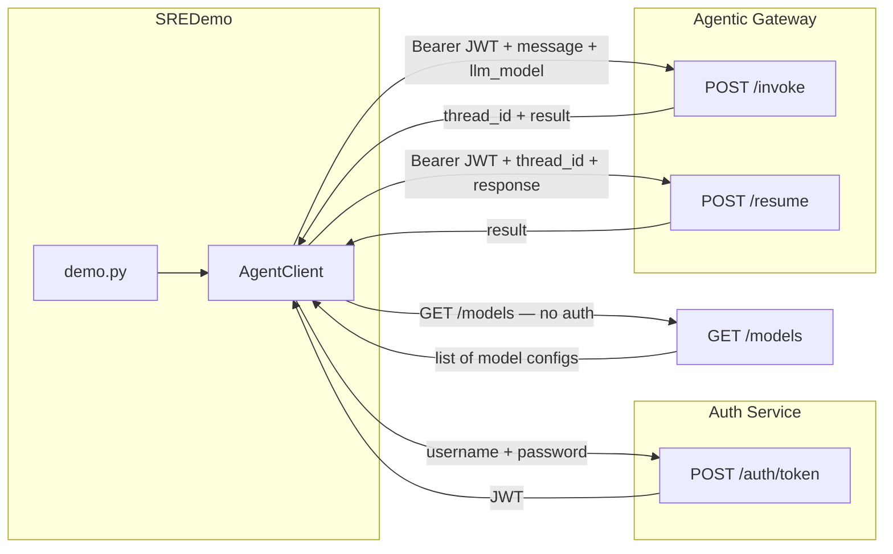
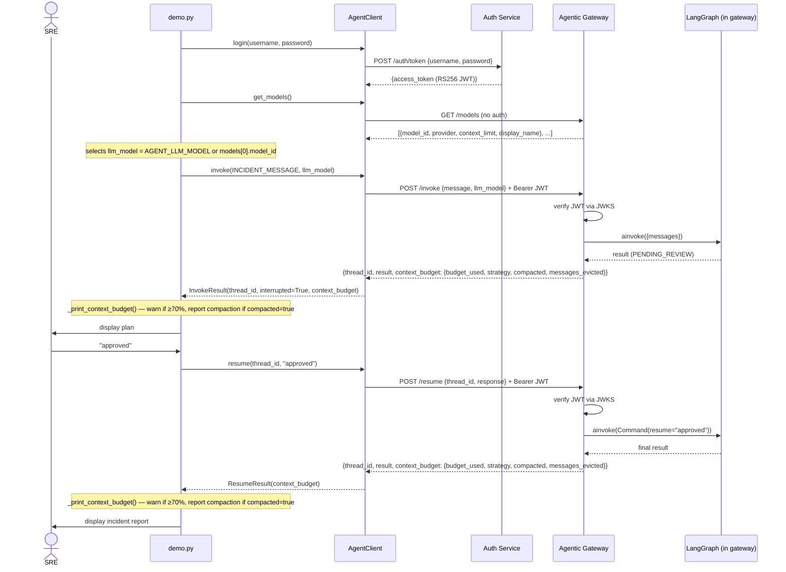

# Design: SREDemo HTTP Integration

> Covers: replacing in-process graph execution with HTTP calls to the AgentCore gateway
> Solution: SREDemo — Section 3 of 3
> Depends on: Auth Service (token issuance) + AgentCore Gateway (session binding)

---

## Overview

SREDemo currently runs the LangGraph graph in-process (`build_graph()` + `MemorySaver`). This section replaces that with HTTP calls to two separate services. SREDemo becomes a pure client: it logs in to the **Auth Service** to get a JWT, then calls the **Agentic Gateway** (`POST /invoke` / `POST /resume`) using that token.

The agent graph, tool execution, and persistence all remain inside AgentCore — SREDemo supplies only the scenario (incident message, credentials, HITL terminal input). The Auth Service and the Agentic Gateway are independently deployed; SREDemo configures each with its own base URL.

---

## High-Level Design



**Key decisions:**
- New `sre_demo/client.py` holds all HTTP logic — `demo.py` stays focused on the scenario flow and terminal UI
- Auth Service and Agentic Gateway have separate base URLs (`AUTH_SERVICE_URL`, `AGENT_API_URL`) — independently deployable and scalable
- `httpx.AsyncClient` (already a dependency) — no new packages needed
- `thread_id` is received from `/invoke` response — not generated locally
- In-process `build_graph()`, `MemorySaver`, `_patch_tool_registry()` are removed from `demo.py`
- Retry and timeout settings on the client handle transient gateway errors

---

## Low-Level Design

### New file: `sre_demo/client.py`

```python
import httpx
from dataclasses import dataclass

@dataclass
class ContextBudget:
    budget_used: float       # post-compaction; always present
    strategy: str            # "pass_through" | "sliding_window" | "subagent_delegation"
    compacted: bool
    messages_evicted: int

@dataclass
class InvokeResult:
    thread_id: str
    result: dict
    interrupted: bool        # True when plan is PENDING_REVIEW
    context_budget: ContextBudget | None = None

@dataclass
class ResumeResult:
    thread_id: str
    result: dict
    context_budget: ContextBudget | None = None


class AgentClient:
    def __init__(self, auth_url: str, gateway_url: str, timeout: float = 120.0):
        self._auth_url = auth_url.rstrip("/")
        self._gateway_url = gateway_url.rstrip("/")
        self._timeout = timeout
        self._token: str | None = None

    async def login(self, username: str, password: str) -> None:
        async with httpx.AsyncClient(timeout=self._timeout) as http:
            resp = await http.post(
                f"{self._auth_url}/auth/token",
                data={"username": username, "password": password},
            )
            resp.raise_for_status()
            self._token = resp.json()["access_token"]

    async def get_models(self) -> list[dict]:
        """Fetch supported models from the gateway (no auth required).
        Returns [{model_id, provider, context_limit, display_name}, ...]
        """
        async with httpx.AsyncClient(timeout=self._timeout) as http:
            resp = await http.get(f"{self._gateway_url}/models")
            resp.raise_for_status()
            return resp.json()

    async def invoke(self, message: str, llm_model: str | None = None) -> InvokeResult:
        body: dict = {"message": message}
        if llm_model:
            body["llm_model"] = llm_model
        resp = await self._post("/invoke", body)
        result = resp.json()
        interrupted = self._is_interrupted(result)
        return InvokeResult(
            thread_id=result["thread_id"],
            result=result,
            interrupted=interrupted,
            context_budget=self._parse_budget(result),
        )

    async def resume(self, thread_id: str, response: str) -> ResumeResult:
        resp = await self._post("/resume", {"thread_id": thread_id, "response": response})
        result = resp.json()
        return ResumeResult(
            thread_id=thread_id,
            result=result,
            context_budget=self._parse_budget(result),
        )

    @staticmethod
    def _parse_budget(result: dict) -> ContextBudget | None:
        raw = result.get("context_budget")
        if not raw:
            return None
        return ContextBudget(
            budget_used=raw["budget_used"],
            strategy=raw["strategy"],
            compacted=raw["compacted"],
            messages_evicted=raw["messages_evicted"],
        )

    async def _post(self, path: str, body: dict) -> httpx.Response:
        if not self._token:
            raise RuntimeError("Not logged in — call login() first")
        async with httpx.AsyncClient(timeout=self._timeout) as http:
            resp = await http.post(
                f"{self._gateway_url}{path}",
                json=body,
                headers={"Authorization": f"Bearer {self._token}"},
            )
            resp.raise_for_status()
            return resp

    @staticmethod
    def _is_interrupted(result: dict) -> bool:
        plan = (result.get("result") or {}).get("plan") or {}
        return plan.get("status") == "PENDING_REVIEW"
```

### New helper: `_print_context_budget()` in `sre_demo/demo.py`

```python
def _print_context_budget(budget: ContextBudget | None) -> None:
    if not budget:
        return
    pct = int(budget.budget_used * 100)
    if budget.compacted:
        print(
            f"  [context] compacted — {budget.messages_evicted} messages evicted. "
            f"Budget now at {pct}% ({budget.strategy})"
        )
    elif pct >= 70:
        print(f"  [context] {pct}% of context window used — approaching threshold")
```

Threshold for the warning (70%) is deliberately lower than the compaction threshold (80%) so the SRE sees a heads-up before compaction fires.

### Modified `sre_demo/demo.py`

Remove:
- `from langgraph.checkpoint.memory import MemorySaver`
- `from agentcore.graph.builder import build_graph`
- `import agentcore.tools.registry as _fw_tool_registry`
- `from sre_demo.registries import build_sre_registry, TOOL_REGISTRY`
- `_patch_tool_registry()` function and call
- `build_sre_registry()` call
- `build_graph(checkpointer=checkpointer, registry=registry)` call
- Local `thread_id = str(uuid.uuid4())` generation

Add:
```python
from sre_demo.client import AgentClient

async def run_demo() -> None:
    _print_banner()

    client = AgentClient(
        auth_url=os.environ["AUTH_SERVICE_URL"],
        gateway_url=os.environ["AGENT_API_URL"],
    )
    await client.login(
        username=os.environ["AGENT_USERNAME"],
        password=os.environ["AGENT_PASSWORD"],
    )

    # GET /models — populate model selector; use env override or first available
    models = await client.get_models()
    llm_model = os.environ.get("AGENT_LLM_MODEL") or models[0]["model_id"]

    # POST /invoke
    _print_section("User Query")
    print(f"\n{INCIDENT_MESSAGE.strip()}\n")
    print(f"\nModel: {llm_model}")
    print("\nRunning extract_intent → extract_entities → plan ...")
    invoke_result = await client.invoke(INCIDENT_MESSAGE, llm_model=llm_model)
    _print_context_budget(invoke_result.context_budget)

    if not invoke_result.interrupted:
        _print_section("Final State")
        _print_state(invoke_result.result)
        return

    # HITL gate
    _print_section("Plan — Awaiting SRE Approval")
    _print_state(invoke_result.result)
    print("\nOptions: [approved] to proceed, or type feedback to revise the plan")
    try:
        hitl_response = input("SRE> ").strip() or "approved"
    except (EOFError, KeyboardInterrupt):
        hitl_response = "approved"
        print(f"(auto-approved)")

    # POST /resume
    print("\nRunning validate_cot → execute_step → report ...")
    resume_result = await client.resume(invoke_result.thread_id, hitl_response)
    _print_context_budget(resume_result.context_budget)

    _print_section("Incident Report")
    _print_state(resume_result.result)
    print("\n" + "=" * 70 + "\n  Demo complete.\n" + "=" * 70 + "\n")
```

### New env vars (`SREDemo/.env.example` additions)

| Variable | Description |
|----------|-------------|
| `AUTH_SERVICE_URL` | Auth Service base URL, e.g. `http://localhost:9000` |
| `AGENT_API_URL` | Agentic Gateway base URL, e.g. `http://localhost:8000` |
| `AGENT_USERNAME` | SRE demo user username |
| `AGENT_PASSWORD` | SRE demo user password |
| `AGENT_LLM_MODEL` | Optional — override model selection (e.g. `claude-opus-4-6`). If absent, first model returned by `GET /models` is used. |

### What is removed from SREDemo

| Item | Removed because |
|------|-----------------|
| `build_graph()` in demo.py | Graph now runs in gateway |
| `MemorySaver` | Checkpointing now in gateway (PostgresSaver or MemorySaver) |
| `_patch_tool_registry()` | Tools are registered in the gateway process, not the demo process |
| `build_sre_registry()` call in demo.py | Registry is passed to gateway's `build_graph` at startup |
| `uuid.uuid4()` for thread_id | Server generates it; demo reads it from `/invoke` response |

Note: `registries.py`, `entities.py`, and tool files are NOT removed — they are still needed by the gateway when the SRE scenario is loaded there.

### Error handling

| Condition | Behaviour in demo.py |
|-----------|----------------------|
| Login fails (401) | `raise_for_status()` propagates; demo prints error and exits |
| `/invoke` network error | `httpx.RequestError` propagates; demo prints error and exits |
| `/resume` 403 (wrong user) | Should not occur in demo (same client throughout); propagates if it does |
| Gateway timeout | `httpx.TimeoutException` propagates; increase `AGENT_API_URL` timeout if needed |

---

## Sequence Diagram



---

## Design Decisions

| Decision | Rationale |
|----------|-----------|
| New `client.py` file, not inline HTTP calls in `demo.py` | Keeps demo.py readable as a scenario script; client is independently testable |
| `httpx.AsyncClient` recreated per call | Connection pooling not needed for a sequential demo; avoids managing a shared client lifecycle |
| `raise_for_status()` with no catch in client | Demo is a CLI tool — failing loudly with an HTTP error is more useful than a custom error message |
| Registry and tool files stay in SREDemo | They describe the SRE scenario (contracts, playbook) — they belong here even if the gateway loads them; in future the gateway could discover them from SREDemo as a plugin |
| `AGENT_USERNAME` / `AGENT_PASSWORD` from env | Consistent with how all other service credentials (AWS, PD, DD) are supplied in this project |

---

## Related Docs
- Auth Service design: `AgentCore/design/auth-service/user-store-token-issuance/design.md`
- Auth Service solution: `AgentCore/requirements/solutions/auth-service/solution.md`
- Gateway design: `AgentCore/design/agent-gateway/gateway-session-binding/design.md`
- SREDemo CLAUDE.md: `SREDemo/CLAUDE.md`
- SREDemo README: `SREDemo/README.md`
